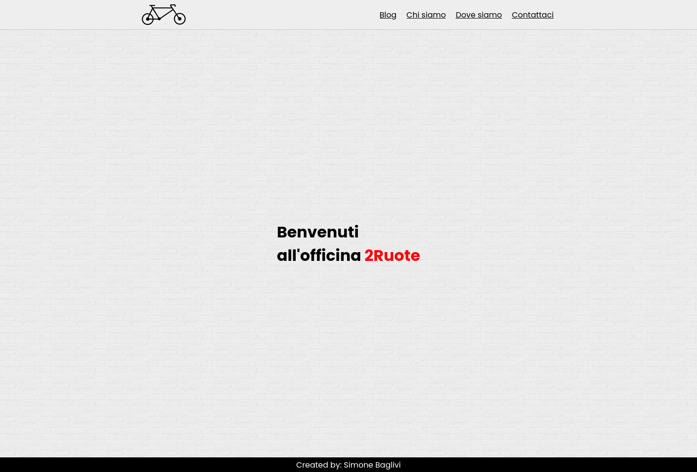

# sbaglivi-wp

Simple and minimalistic wordpress custom theme.

The theme features:
 - front-page, 
 - a blog index page (which doubles as a search results page as well),
 - a single blog view page,
 - a 404 page,
 - an about us page,
 - a where are we page (with a google maps embed) and a 
 - contact us page (that uses a form made with 'WPForms' and integrated with 'WP Mail SMTP' to be able to send mails through GMail).

## Built with:
The project uses:
- HTML & CSS
- PHP
- [MySQL](https://www.mysql.com/) as the database
- [Wordpress](https://wordpress.org) as the CMS

## How to use:
In order to use the application you need to have wordpress installed on your system.
If you have that:
- Clone the repository into your wordpress/wp-content/themes folder
- Activate the theme from your dashboard

I have created a .wordpress export with the 'All-in-One WP Migration' plugin to be able to import pages / posts / comments / plugins as well.

## Created by:
[Simone Baglivi](https:/github.com/sbaglivi)

